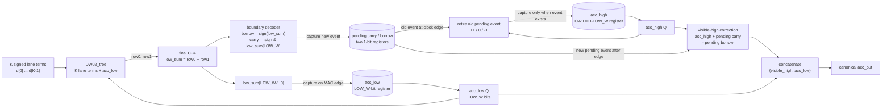

# Signed segmented accumulator

This design point keeps the exact full-width output-stationary accumulator but
confines the per-cycle signed reduction to a low residue bank.

For radix `R = 2**LOW_W`, one MAC computes the true signed contribution `d` and
forms `s = acc_low + d`.  The low bank takes `s mod R`; a carry or borrow event
records whether the upper bank must change by `+1` or `-1`.  That two-state
event is pipelined for one cycle so the low heap and upper increment/decrement
path are independent.

The visible accumulator includes the pending event:

```
acc_out = {(acc_high + pending_carry - pending_borrow), acc_low}
```

It is therefore canonical after every MAC and during row-serial drain, even
though the physical high register retires the event one cycle later.

Unlike the blockwise-biased design, this variant has no bias, block correction,
fixed block length, or stable-sign requirement.  `2**LOW_W` must be at least
`K*M`, ensuring a cycle produces at most one carry or borrow.

## Post-heap accumulator circuit

The diagram below starts at the signed lane terms and shows both accumulator
paths.  `P` is a signed one-radix event encoded by the mutually exclusive
`pending_carry` and `pending_borrow` flops.



At a shift edge, `shift_in` overrides the MAC path: the low and high slices of
the canonical west input are loaded directly and both pending bits are cleared.
The outgoing value is still correct because `acc_out` includes the local
pending event before the edge.

## Why a one-cycle-pending event is exact

Let

```
R = 2**LOW_W
P = +1 for pending_carry, -1 for pending_borrow, otherwise 0
```

Immediately before a clock edge, the architectural value represented by the
state is

```
X = (acc_high + P)*R + acc_low.
```

For the current signed MAC contribution `d`, the low heap computes

```
s  = acc_low + d
L' = s mod R
P' = floor(s/R).
```

At the same edge, the high register retires the *old* pending event while the
low and pending registers capture the new result:

```
H' = acc_high + P
acc_low' = L'
pending' = P'.
```

The visible value immediately after the edge is therefore

```
X' = (H' + P')*R + L'
   = (acc_high + P)*R + acc_low + d
   = X + d.
```

Thus the registered high bank can lag by one event without the architectural
output lagging.  The previous pending event is retired and the new event is
made visible in the same cycle.

The constraint `R >= K*M` bounds

```
-R <= acc_low + d <= 2*R - 1,
```

so `P'` can only be `-1`, `0`, or `+1`.  No multi-bit carry counter is needed.

## Carry and borrow examples

For the current `LOW_W=9` point, `R=512`:

| case | old `(H, L, P)` | `d` | heap sum `s` | new `(H', L', P')` | visible result |
|---|---|---:|---:|---|---:|
| carry | `(10, 500, 0)` | `+40` | `540` | `(10, 28, +1)` | `11*512 + 28 = 5660` |
| borrow | `(10, 12, 0)` | `-40` | `-28` | `(10, 484, -1)` | `9*512 + 484 = 5092` |

On the following edge, the pending `+1` or `-1` is folded into `acc_high`.
If that following MAC does not cross a boundary, the new pending event becomes
zero and the visible numerical value does not change merely because the event
was retired.
